# 📊 Diagramas de Arquitectura - Sistema Gateway Agrícola

## 🏗️ Arquitectura General del Sistema


## 🔄 Flujo de Datos del Gateway

```mermaid
sequenceDiagram
    participant Gateway as Gateway
    participant Node1 as Sensor Node 1
    participant Node2 as Sensor Node 2
    participant RTC as RTC Module
    participant Log as System Log

    Note over Gateway: Inicialización del Sistema
    Gateway->>RTC: Inicializar RTC
    Gateway->>Log: Log: Sistema iniciado
    Gateway->>Gateway: Enviar ANNOUNCE

    loop Cada 30 segundos
        Gateway->>Gateway: Enviar ANNOUNCE
        Gateway->>Log: Log: ANNOUNCE enviado
    end

    Node1->>Gateway: HELLO
    Gateway->>Log: Log: Nodo 1 registrado
    Node2->>Gateway: HELLO
    Gateway->>Log: Log: Nodo 2 registrado

    loop Cada 5 minutos
        Gateway->>Node1: REQUEST_DATA_ATMOSPHERIC
        Node1->>Gateway: DATA_ATMOSPHERIC
        Gateway->>Log: Log: Datos atmosféricos recibidos
        Gateway->>Gateway: Almacenar datos

        Gateway->>Node2: REQUEST_DATA_ATMOSPHERIC
        Node2->>Gateway: DATA_ATMOSPHERIC
        Gateway->>Log: Log: Datos atmosféricos recibidos
        Gateway->>Gateway: Almacenar datos
    end

    loop Cada 12/24 horas
        Gateway->>Node1: REQUEST_DATA_GPS_GROUND
        Node1->>Gateway: DATA_GPS_GROUND
        Gateway->>Log: Log: Datos suelo/GPS recibidos
        Gateway->>Gateway: Almacenar datos
    end
```



## 🧩 Estructura Modular del Código


## 📡 Protocolo de Comunicación

```mermaid
stateDiagram-v2
    [*] --> Inicialización
    Inicialización --> EnviandoANNOUNCE
    EnviandoANNOUNCE --> EsperandoHELLO
    EsperandoHELLO --> RegistrandoNodos
    RegistrandoNodos --> SolicitandoDatosAtmosféricos
    SolicitandoDatosAtmosféricos --> RecibiendoDatosAtmosféricos
    RecibiendoDatosAtmosféricos --> SolicitandoDatosSuelo
    SolicitandoDatosSuelo --> RecibiendoDatosSuelo
    RecibiendoDatosSuelo --> EsperandoHELLO

    EsperandoHELLO --> ErrorComunicación
    ErrorComunicación --> EsperandoHELLO

    RecibiendoDatosAtmosféricos --> ErrorDatos
    ErrorDatos --> SolicitandoDatosAtmosféricos

    RecibiendoDatosSuelo --> ErrorDatos
    ErrorDatos --> SolicitandoDatosSuelo
```



## 🗂️ Estructura de Datos


## 📊 Logs del Sistema

### Ejemplo de Log de Inicialización

```
[2025-01-15 08:30:15] INFO: Sistema Gateway Agrícola iniciado
[2025-01-15 08:30:15] INFO: NodeIdentity inicializado - MAC: AA:BB:CC:DD:EE:FF
[2025-01-15 08:30:16] INFO: RadioManager inicializado - Frecuencia: 915MHz
[2025-01-15 08:30:16] INFO: RTC inicializado - Fecha: 2025-01-15 08:30:16
[2025-01-15 08:30:17] INFO: AppLogic inicializado - Modo Gateway
[2025-01-15 08:30:17] INFO: ANNOUNCE enviado - Broadcast a la red
```

### Ejemplo de Log de Comunicación

```
[2025-01-15 08:30:45] INFO: HELLO recibido de nodo 0x42 - MAC: 11:22:33:44:55:66
[2025-01-15 08:30:45] INFO: Nodo registrado - ID: 0x42, MAC: 11:22:33:44:55:66
[2025-01-15 08:30:50] INFO: HELLO recibido de nodo 0x7A - MAC: AA:BB:CC:DD:EE:FF
[2025-01-15 08:30:50] INFO: Nodo registrado - ID: 0x7A, MAC: AA:BB:CC:DD:EE:FF
[2025-01-15 08:35:00] INFO: Solicitando datos atmosféricos a nodo 0x42
[2025-01-15 08:35:02] INFO: Datos atmosféricos recibidos de nodo 0x42
[2025-01-15 08:35:02] INFO: Temperatura: 25.3°C, Humedad: 65.2%
[2025-01-15 08:35:05] INFO: Solicitando datos atmosféricos a nodo 0x7A
[2025-01-15 08:35:07] INFO: Datos atmosféricos recibidos de nodo 0x7A
[2025-01-15 08:35:07] INFO: Temperatura: 24.8°C, Humedad: 68.1%
```

### Ejemplo de Log de Errores

```
[2025-01-15 08:40:00] WARN: Timeout en solicitud a nodo 0x42
[2025-01-15 08:40:00] WARN: Reintentando solicitud a nodo 0x42
[2025-01-15 08:40:03] ERROR: Nodo 0x42 no responde - Agregado a nodesDown
[2025-01-15 08:40:05] INFO: Datos atmosféricos recibidos de nodo 0x7A
[2025-01-15 08:40:05] INFO: Temperatura: 25.1°C, Humedad: 66.3%
```

### Ejemplo de Log de Datos de Suelo/GPS

```
[2025-01-15 12:00:00] INFO: Solicitando datos suelo/GPS a nodo 0x42
[2025-01-15 12:00:03] INFO: Datos suelo/GPS recibidos de nodo 0x42
[2025-01-15 12:00:03] INFO: Humedad suelo: 45.2%, Temp suelo: 18.5°C
[2025-01-15 12:00:03] INFO: pH: 6.8, Conductividad: 1250 µS/cm
[2025-01-15 12:00:03] INFO: GPS: Lat: -34.6037, Lon: -58.3816
[2025-01-15 12:00:05] INFO: Solicitando datos suelo/GPS a nodo 0x7A
[2025-01-15 12:00:08] INFO: Datos suelo/GPS recibidos de nodo 0x7A
[2025-01-15 12:00:08] INFO: Humedad suelo: 52.1%, Temp suelo: 19.2°C
[2025-01-15 12:00:08] INFO: pH: 7.1, Conductividad: 1380 µS/cm
[2025-01-15 12:00:08] INFO: GPS: Lat: -34.6042, Lon: -58.3821
```

## 🔧 Configuración de Hardware


## 📈 Métricas del Sistema

### Capacidades del Gateway

- **Nodos máximos**: 250 nodos
- **Muestras atmosféricas por nodo**: 8 muestras
- **Muestras suelo/GPS por nodo**: 2 muestras
- **Intervalo ANNOUNCE**: 5 segundos (debug) / 2 minutos (producción)
- **Intervalo datos atmosféricos**: 30 segundos (debug) / 8 minutos (producción)
- **Intervalo datos suelo/GPS**: 12 y 24 horas

### Consumo de Memoria

- **AtmosphericSample**: 6 bytes por muestra
- **GroundGpsPacket**: 24 bytes por muestra
- **Total por nodo**: 8 × 6 + 2 × 24 = 96 bytes
- **Total 250 nodos**: 24 KB de datos

---

_Diagramas generados con Mermaid para la documentación del Sistema Gateway Agrícola_

# Diagrama de Conexiones de la Placa

A continuación se muestra un diagrama en bloques que representa las conexiones físicas entre la placa principal (ESP8266/ESP32) y los módulos periféricos utilizados en el sistema:

```mermaid
%% Incluido desde docs/diagramas_arquitectura/conexiones_placa.mmd

graph TD
    ESP[ESP8266 / ESP32]
    LORA[LoRa SX1278]
    RTC[RTC DS1302]
    DHT[DHT22 Sensor]
    GPS[GPS Neo-6M]
    POWER[Fuente de Alimentación]

    POWER --> ESP
    ESP -- SPI (MOSI/MISO/SCK/CS) --> LORA
    ESP -- 3-wire (IO/SCLK/CE) --> RTC
    ESP -- GPIO (D2) --> DHT
    ESP -- UART (RX/TX) --> GPS
    LORA -- Antena --> ANT[Antena 433MHz]
```



> El archivo fuente editable de este diagrama se encuentra en: `docs/diagramas_arquitectura/conexiones_placa.mmd`.

**Descripción:**

- La placa ESP8266/ESP32 se conecta a los módulos LoRa, RTC, DHT22 y GPS mediante diferentes interfaces (SPI, 3-wire, GPIO, UART).
- La fuente de alimentación provee energía a la placa principal.
- El módulo LoRa se conecta a una antena externa para la comunicación inalámbrica de largo alcance.
