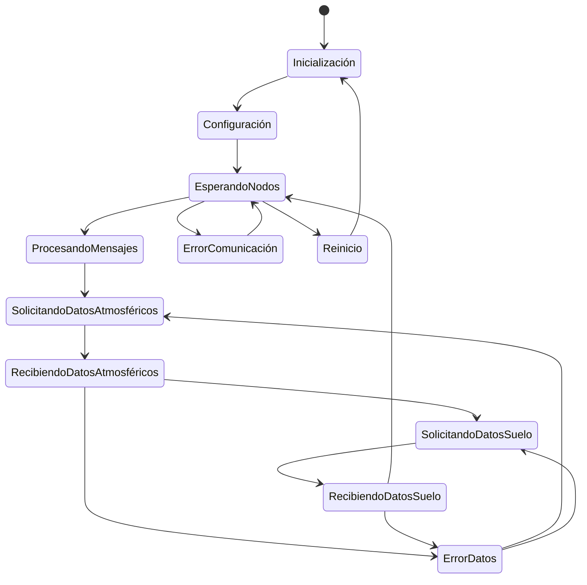

# 🎯 Diagrama de Estados del Sistema

```mermaid
stateDiagram-v2
    [*] --> Inicialización
    Inicialización --> Configuración
    Configuración --> EsperandoNodos
    EsperandoNodos --> ProcesandoMensajes
    ProcesandoMensajes --> SolicitandoDatosAtmosféricos
    SolicitandoDatosAtmosféricos --> RecibiendoDatosAtmosféricos
    RecibiendoDatosAtmosféricos --> SolicitandoDatosSuelo
    SolicitandoDatosSuelo --> RecibiendoDatosSuelo
    RecibiendoDatosSuelo --> EsperandoNodos
    
    EsperandoNodos --> ErrorComunicación
    ErrorComunicación --> EsperandoNodos
    
    RecibiendoDatosAtmosféricos --> ErrorDatos
    ErrorDatos --> SolicitandoDatosAtmosféricos
    
    RecibiendoDatosSuelo --> ErrorDatos
    ErrorDatos --> SolicitandoDatosSuelo
    
    EsperandoNodos --> Reinicio
    Reinicio --> Inicialización
```