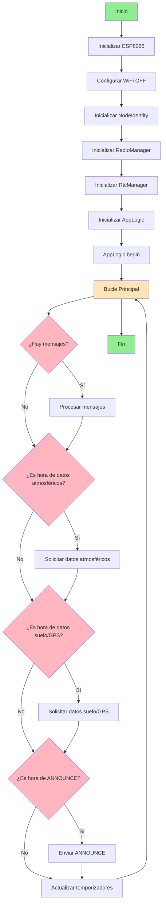

# 🔄 Diagrama de Flujo Avanzado

```mermaid
flowchart TD
    A[Inicio] --> B[Inicializar ESP8266]
    B --> C[Configurar WiFi OFF]
    C --> D[Inicializar NodeIdentity]
    D --> E[Inicializar RadioManager]
    E --> F[Inicializar RtcManager]
    F --> G[Inicializar AppLogic]
    G --> H[AppLogic.begin]
    H --> I[Bucle Principal]
    
    I --> J{¿Hay mensajes?}
    J -->|Sí| K[Procesar mensajes]
    J -->|No| L{¿Es hora de datos atmosféricos?}
    
    K --> L
    
    L -->|Sí| M[Solicitar datos atmosféricos]
    L -->|No| N{¿Es hora de datos suelo/GPS?}
    
    M --> N
    
    N -->|Sí| O[Solicitar datos suelo/GPS]
    N -->|No| P{¿Es hora de ANNOUNCE?}
    
    O --> P
    
    P -->|Sí| Q[Enviar ANNOUNCE]
    P -->|No| R[Actualizar temporizadores]
    
    Q --> R
    R --> I
    
    I --> S[Fin]
    
    style A fill:#90EE90
    style S fill:#90EE90
    style I fill:#FFE4B5
    style J fill:#FFB6C1
    style L fill:#FFB6C1
    style N fill:#FFB6C1
    style P fill:#FFB6C1
```