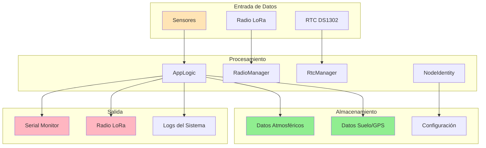

# 📊 Diagrama de Flujo de Datos

```mermaid
graph TD
    subgraph "Entrada de Datos"
        SENSORS[Sensores]
        RTC[RTC DS1302]
        RADIO[Radio LoRa]
    end
    
    subgraph "Procesamiento"
        NI[NodeIdentity]
        RM[RadioManager]
        RTCM[RtcManager]
        AL[AppLogic]
    end
    
    subgraph "Almacenamiento"
        ATMOS_DATA[Datos Atmosféricos]
        GROUND_DATA[Datos Suelo/GPS]
        CONFIG[Configuración]
    end
    
    subgraph "Salida"
        SERIAL[Serial Monitor]
        RADIO_OUT[Radio LoRa]
        LOGS[Logs del Sistema]
    end
    
    SENSORS --> AL
    RTC --> RTCM
    RADIO --> RM
    
    AL --> ATMOS_DATA
    AL --> GROUND_DATA
    NI --> CONFIG
    
    AL --> SERIAL
    AL --> RADIO_OUT
    AL --> LOGS
    
    style SENSORS fill:#FFE4B5
    style ATMOS_DATA fill:#90EE90
    style GROUND_DATA fill:#90EE90
    style SERIAL fill:#FFB6C1
    style RADIO_OUT fill:#FFB6C1
```