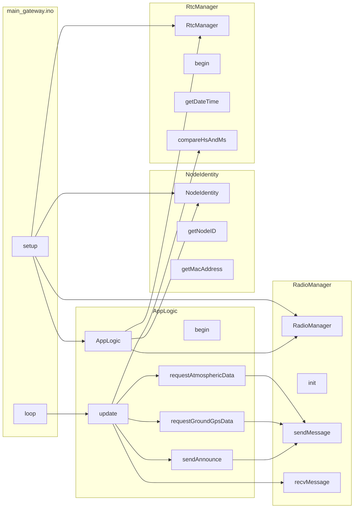

# 📞 Gráfico de Llamadas de Funciones

```mermaid
graph LR
    subgraph "main_gateway.ino"
        MAIN[setup]
        LOOP[loop]
    end
    
    subgraph "AppLogic"
        AL[AppLogic]
        BEGIN[begin]
        UPDATE[update]
        REQ_ATM[requestAtmosphericData]
        REQ_GRD[requestGroundGpsData]
        SEND_ANN[sendAnnounce]
    end
    
    subgraph "RadioManager"
        RM[RadioManager]
        INIT[init]
        SEND[sendMessage]
        RECV[recvMessage]
    end
    
    subgraph "NodeIdentity"
        NI[NodeIdentity]
        GET_ID[getNodeID]
        GET_MAC[getMacAddress]
    end
    
    subgraph "RtcManager"
        RTCM[RtcManager]
        BEGIN_RTC[begin]
        GET_TIME[getDateTime]
        COMPARE[compareHsAndMs]
    end
    
    MAIN --> AL
    MAIN --> RM
    MAIN --> NI
    MAIN --> RTCM
    
    LOOP --> UPDATE
    UPDATE --> REQ_ATM
    UPDATE --> REQ_GRD
    UPDATE --> SEND_ANN
    
    REQ_ATM --> SEND
    REQ_GRD --> SEND
    SEND_ANN --> SEND
    
    UPDATE --> RECV
    UPDATE --> COMPARE
    
    AL --> NI
    AL --> RM
    AL --> RTCM
```