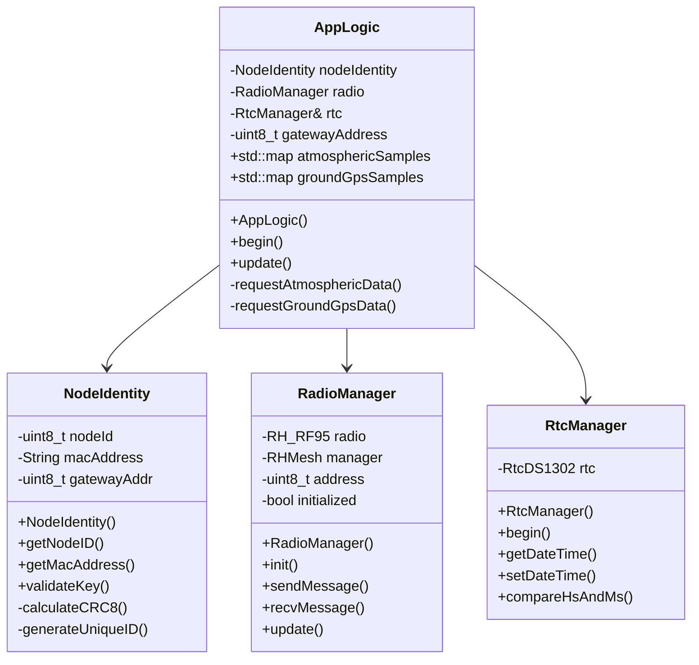

# 🏗️ Diagrama de Clases

```mermaid
classDiagram
    class AppLogic {
        -NodeIdentity nodeIdentity
        -RadioManager radio
        -RtcManager& rtc
        -uint8_t gatewayAddress
        +std::map atmosphericSamples
        +std::map groundGpsSamples
        +AppLogic()
        +begin()
        +update()
        -requestAtmosphericData()
        -requestGroundGpsData()
    }
    
    class NodeIdentity {
        -uint8_t nodeId
        -String macAddress
        -uint8_t gatewayAddr
        +NodeIdentity()
        +getNodeID()
        +getMacAddress()
        +validateKey()
        -calculateCRC8()
        -generateUniqueID()
    }
    
    class RadioManager {
        -RH_RF95 radio
        -RHMesh manager
        -uint8_t address
        -bool initialized
        +RadioManager()
        +init()
        +sendMessage()
        +recvMessage()
        +update()
    }
    
    class RtcManager {
        -RtcDS1302 rtc
        +RtcManager()
        +begin()
        +getDateTime()
        +setDateTime()
        +compareHsAndMs()
    }
    
    AppLogic --> NodeIdentity
    AppLogic --> RadioManager
    AppLogic --> RtcManager
```