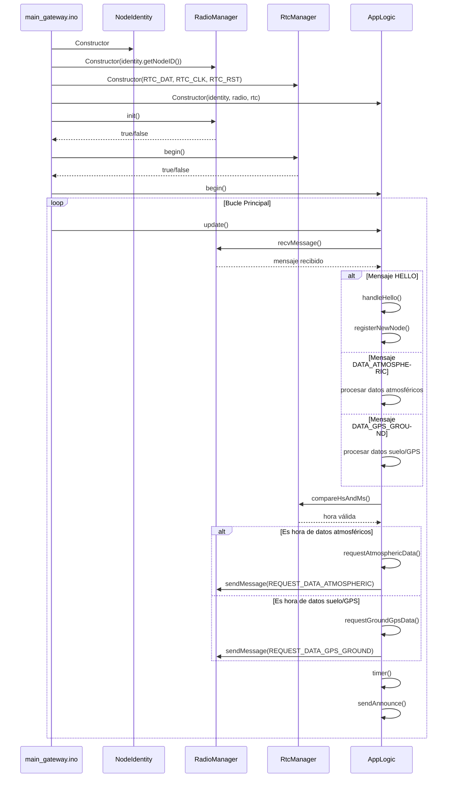

# ⏱️ Diagrama de Secuencia

```mermaid
sequenceDiagram
    participant Main as main_gateway.ino
    participant NI as NodeIdentity
    participant RM as RadioManager
    participant RTCM as RtcManager
    participant AL as AppLogic
    
    Main->>NI: Constructor
    Main->>RM: Constructor(identity.getNodeID())
    Main->>RTCM: Constructor(RTC_DAT, RTC_CLK, RTC_RST)
    Main->>AL: Constructor(identity, radio, rtc)
    
    Main->>RM: init()
    RM-->>Main: true/false
    
    Main->>RTCM: begin()
    RTCM-->>Main: true/false
    
    Main->>AL: begin()
    
    loop Bucle Principal
        Main->>AL: update()
        AL->>RM: recvMessage()
        RM-->>AL: mensaje recibido
        
        alt Mensaje HELLO
            AL->>AL: handleHello()
            AL->>AL: registerNewNode()
        else Mensaje DATA_ATMOSPHERIC
            AL->>AL: procesar datos atmosféricos
        else Mensaje DATA_GPS_GROUND
            AL->>AL: procesar datos suelo/GPS
        end
        
        AL->>RTCM: compareHsAndMs()
        RTCM-->>AL: hora válida
        
        alt Es hora de datos atmosféricos
            AL->>AL: requestAtmosphericData()
            AL->>RM: sendMessage(REQUEST_DATA_ATMOSPHERIC)
        else Es hora de datos suelo/GPS
            AL->>AL: requestGroundGpsData()
            AL->>RM: sendMessage(REQUEST_DATA_GPS_GROUND)
        end
        
        AL->>AL: timer()
        AL->>AL: sendAnnounce()
    end
```