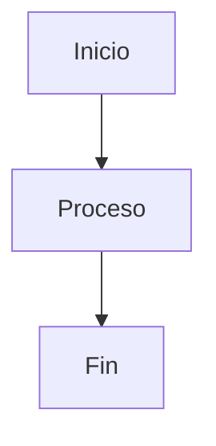

# 🎨 Herramientas para Generar Diagramas de Código

## 🐍 **Scripts Python Disponibles**

### 📊 **generate_flowcharts.py**

Genera diagramas básicos de flujo del código:

- **Diagrama de flujo principal**
- **Diagrama de clases**
- **Diagrama de secuencia**

```bash
python generate_flowcharts.py
```

### 🚀 **generate_advanced_diagrams.py**

Genera diagramas avanzados con múltiples formatos:

- **Flujo avanzado con estilos**
- **Gráfico de llamadas de funciones**
- **Diagrama de flujo de datos**
- **Diagrama de estados del sistema**
- **Archivo Graphviz DOT**

```bash
python generate_advanced_diagrams.py
```

### 📦 **install_diagram_deps.py**

Instala dependencias necesarias para diagramas:

- **graphviz**: Diagramas vectoriales
- **pyflowchart**: Diagramas de flujo
- **pydot**: Manipulación DOT
- **matplotlib**: Gráficos
- **networkx**: Análisis de redes

```bash
python install_diagram_deps.py
```

## 🎯 **Tipos de Diagramas Generados**

### 🔄 **Diagramas de Flujo**

- **Formato**: Mermaid Flowchart
- **Contenido**: Flujo del programa principal
- **Características**: Decisiones, bucles, procesos
- **Archivo**: `docs/diagramas_codigo/flujo_principal.md`

### 🏗️ **Diagramas de Clases**

- **Formato**: Mermaid Class Diagram
- **Contenido**: Estructura de clases y relaciones
- **Características**: Atributos, métodos, herencia
- **Archivo**: `docs/diagramas_codigo/diagrama_clases.md`

### ⏱️ **Diagramas de Secuencia**

- **Formato**: Mermaid Sequence Diagram
- **Contenido**: Interacción entre componentes
- **Características**: Mensajes, temporización
- **Archivo**: `docs/diagramas_codigo/diagrama_secuencia.md`

### 📞 **Gráficos de Llamadas**

- **Formato**: Mermaid Graph
- **Contenido**: Dependencias entre funciones
- **Características**: Subgráficos por módulo
- **Archivo**: `docs/diagramas_avanzados/llamadas_funciones.md`

### 📊 **Diagramas de Flujo de Datos**

- **Formato**: Mermaid Graph
- **Contenido**: Flujo de datos entre componentes
- **Características**: Entrada, procesamiento, salida
- **Archivo**: `docs/diagramas_avanzados/flujo_datos.md`

### 🎯 **Diagramas de Estados**

- **Formato**: Mermaid State Diagram
- **Contenido**: Estados del sistema
- **Características**: Transiciones, eventos
- **Archivo**: `docs/diagramas_avanzados/estados_sistema.md`

## 🛠️ **Herramientas Externas**

### 📈 **Mermaid**

- **Sitio**: https://mermaid-js.github.io/mermaid/
- **Editor**: https://mermaid.live/
- **Integración**: GitHub, GitLab, Sphinx
- **Formato**: Markdown con bloques de código

### 🎨 **Graphviz**

- **Sitio**: https://graphviz.org/
- **Formato**: DOT language
- **Salida**: PNG, SVG, PDF
- **Comando**: `dot -Tpng archivo.dot -o salida.png`

### 📊 **PyFlowchart**

- **Documentación**: https://github.com/cdfmlr/pyflowchart
- **Uso**: Convierte código Python a diagramas
- **Formato**: Mermaid, DOT
- **Instalación**: `pip install pyflowchart`

### 🔍 **NetworkX**

- **Documentación**: https://networkx.org/
- **Uso**: Análisis de redes y grafos
- **Visualización**: Matplotlib
- **Instalación**: `pip install networkx`

## 📋 **Comandos Útiles**

### 🔧 **Instalar Dependencias**

```bash
# Instalar todas las dependencias
python install_diagram_deps.py

# Instalar manualmente
pip install graphviz pyflowchart pydot matplotlib networkx
```

### 📊 **Generar Diagramas**

```bash
# Diagramas básicos
python generate_flowcharts.py

# Diagramas avanzados
python generate_advanced_diagrams.py

# Ambos
python generate_flowcharts.py && python generate_advanced_diagrams.py
```

### 🎨 **Convertir Formatos**

```bash
# DOT a PNG
dot -Tpng docs/diagramas_avanzados/graphviz.dot -o diagrama.png

# DOT a SVG
dot -Tsvg docs/diagramas_avanzados/graphviz.dot -o diagrama.svg

# DOT a PDF
dot -Tpdf docs/diagramas_avanzados/graphviz.dot -o diagrama.pdf
```

### 📖 **Regenerar Documentación**

```bash
# Generar HTML
sphinx-build -b html docs docs/_build/html

# Servir localmente
python -m http.server 8000 --directory docs/_build/html
```

## 🎯 **Casos de Uso**

### 🔍 **Análisis de Código**

- **Identificar funciones** principales
- **Mapear dependencias** entre módulos
- **Visualizar flujo** de datos
- **Detectar complejidad** ciclomática

### 📚 **Documentación**

- **Explicar arquitectura** del sistema
- **Mostrar interacciones** entre componentes
- **Ilustrar flujos** de trabajo
- **Documentar estados** del sistema

### 🛠️ **Mantenimiento**

- **Identificar puntos** de fallo
- **Optimizar rutas** críticas
- **Refactorizar código** complejo
- **Planificar mejoras** futuras

## 🚀 **Integración con Sphinx**

### 📄 **Configuración**

```python
# conf.py
extensions = [
    'sphinx.ext.autodoc',
    'myst_parser',
    'sphinx_mermaid',  # Si está disponible
]
```

### 📝 **Uso en Documentación**

````markdown
# En archivos .md


````

# En archivos .rst

.. mermaid::

flowchart TD
A[Inicio] --> B[Proceso]
B --> C[Fin]

```

## 🎉 **Ventajas de esta Aproximación**

### ✅ **Automático**
- **Generación automática** desde código fuente
- **Actualización automática** al cambiar código
- **Consistencia** entre código y documentación

### ✅ **Múltiples Formatos**
- **Mermaid**: Para web y documentación
- **Graphviz**: Para publicaciones
- **PNG/SVG**: Para presentaciones
- **PDF**: Para impresión

### ✅ **Integrado**
- **Sphinx**: Documentación técnica
- **GitHub**: Visualización automática
- **GitLab**: Soporte nativo
- **Markdown**: Compatibilidad universal

---

*Herramientas para generar diagramas de código automáticamente desde Python* 🐍✨
```
